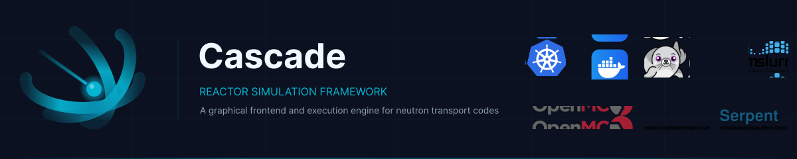
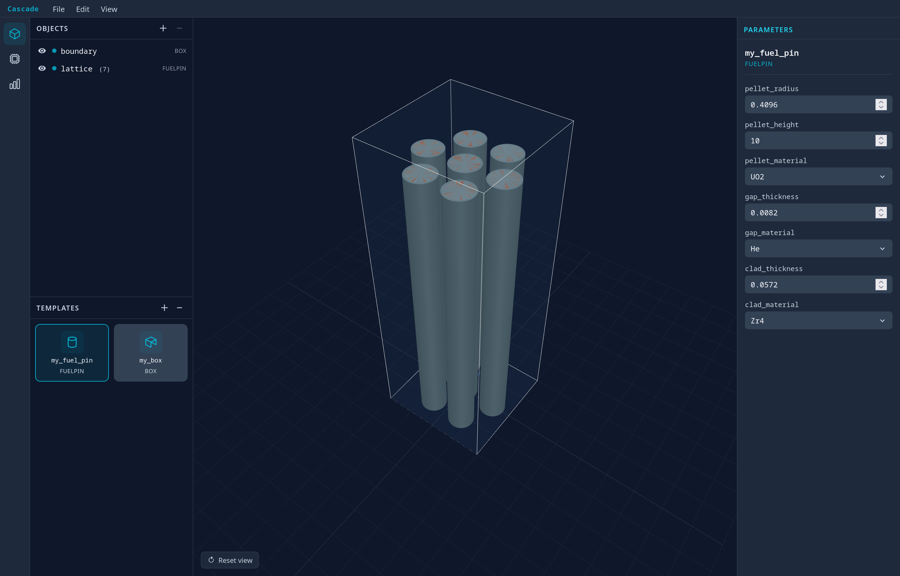

<p align="center">
  
</p>

<p align="center">
  
</p>

---

## What is Cascade?

Setting up a reactor simulation in OpenMC or Serpent2 means writing geometry by hand, managing material definitions in code, configuring runs manually, and parsing output files yourself. For a single pin cell this is manageable. For a parametric sweep across dozens of configurations, it becomes a significant engineering effort before any physics has been computed.

Cascade wraps that process. It provides a visual geometry editor, a declarative DSL for describing reactor geometry, and an execution engine that runs simulation jobs across local machines, Docker containers, Slurm clusters, or Kubernetes — without changing the problem definition.

---

## Features

**Visual Geometry Editor**
A 3D editor for building reactor geometry. Define templates (fuel pins, bounding boxes), place and configure them in a live viewport, and inspect parameters in the side panel. The editor serialises to the Cascade DSL automatically.

**Declarative DSL**
Geometry and materials are described in a readable YAML format. Components are defined once and reused. Sweep parameters across a range to generate batch jobs from a single definition.

```yaml
fuel_pin:
  type: FuelPin
  pellet_radius: 0.4096
  pellet_height: 365.76
  pellet_material: UO2
  gap_thickness: 0.0082
  gap_material: He
  clad_thickness: 0.0572
  clad_material: Zr4

boundary:
  type: BoundingBox
  x_size: 1.26
  y_size: 1.26
  z_min: 0.0
  z_max: 365.76
  material: H2O
  boundary_type: reflective
```

**Simulation Adapters**
Cascade translates the internal geometry representation into input files for OpenMC and Serpent2. The same problem definition runs on either code without modification.

**Execution Backends**
Jobs can be dispatched to:
- Local process
- Docker container
- Slurm HPC cluster
- Kubernetes

The backend is selected per-job and does not affect the problem definition.

---

## Architecture

```
Editor (React)
    │
    ▼
DSL (YAML) ──► Loader ──► Expander ──► CascadeGeometry
                                            │
                              ┌─────────────┴─────────────┐
                              ▼                           ▼
                        OpenMC Adapter           Serpent2 Adapter
                              │                           │
                        Input files               Input files
                              │                           │
                    ┌─────────┴──────────┐
                    ▼                    ▼
              Local / Docker       Slurm / K8s
                    │
                    ▼
                Results
```

---

## Project Status

Cascade is an academic project under active development. The table below reflects the current state.

| Component | Status |
|---|---|
| Geometry editor (3D viewport) | Working |
| FuelPin DSL schema | Working |
| BoundingBox DSL schema | Working |
| DSL loader and validator | Working |
| Geometry expander | Working |
| OpenMC adapter | In progress |
| Serpent2 adapter | In progress |
| Local execution backend | Working |
| Docker execution backend | In progress |
| Slurm execution backend | Planned |
| Kubernetes execution backend | Planned |
| Material library | In progress |
| Parameter sweep engine | In progress |
| Results parser and viewer | Planned |

---

## Getting Started

### Prerequisites

- Python 3.12+
- [uv](https://github.com/astral-sh/uv) (recommended) or pip
- Node.js 20+ (for the frontend)
- OpenMC or Serpent2 installed and on your PATH (for running simulations)

### Backend

```bash
cd backend
uv sync
uv run uvicorn cascade.main:app --reload
```

The API will be available at `http://localhost:8000`.

### Frontend

```bash
cd frontend
npm install
npm run dev
```

The editor will be available at `http://localhost:5173`.

---

## Repository Structure

```
cascade/
├── backend/
│   ├── cascade/
│   │   ├── adapters/       # OpenMC and Serpent2 translators
│   │   ├── api/            # FastAPI routes
│   │   ├── domain/         # Core geometry and job types
│   │   ├── dsl/            # YAML loader, expander, schema definitions
│   │   ├── execution/      # Local, Docker, Slurm, Kubernetes backends
│   │   ├── libraries/      # Material and nuclear data libraries
│   │   ├── repositories/   # Database access
│   │   └── services/       # Business logic
│   └── tests/
└── frontend/
```

---

## DSL Reference

### FuelPin

A parametric PWR-style fuel pin. All dimensions in centimetres.

| Field | Default | Description |
|---|---|---|
| `pellet_radius` | `0.4096` | Outer radius of the fuel pellet |
| `pellet_height` | `365.76` | Active height of the fuel column |
| `pellet_material` | `UO2` | Material ID for the pellet |
| `gap_thickness` | `0.0082` | Radial thickness of the pellet-clad gap. Set to `0` to omit. |
| `gap_material` | `He` | Material ID for the gap fill gas |
| `clad_thickness` | `0.0572` | Radial wall thickness of the cladding |
| `clad_material` | `Zr4` | Material ID for the cladding |

### BoundingBox

Rectangular outer boundary for the simulation problem. All six surfaces receive the same boundary condition.

| Field | Default | Description |
|---|---|---|
| `x_size` | `1.26` | Full width in X, centred on origin (cm) |
| `y_size` | `1.26` | Full width in Y, centred on origin (cm) |
| `z_min` | `0.0` | Bottom Z coordinate (cm) |
| `z_max` | `365.76` | Top Z coordinate (cm) |
| `material` | `H2O` | Fill material outside inner geometry |
| `boundary_type` | `reflective` | `reflective`, `vacuum`, or `periodic` |

---

## Acknowledgements

Cascade is built on top of [OpenMC](https://openmc.org) and [Serpent2](http://montecarlo.vtt.fi). Default geometry parameters follow IAEA-TECDOC-1234 PWR reference values.

---

<p align="center">
  <sub>Academic project · Not production ready · Breaking changes expected</sub>
</p>